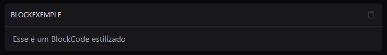

<div style="width: 100%;">
  
</div>

<div align="center">

  <p>
    <strong>Renderizador de arquivos MDX</strong>
  </p>

  
</div>

## Demo

[mdxRenderDocs](https://mdxrenderdocs.vercel.app/intro)

## About
**mdxRenderDocs** é um projeto básico de estudo sobre criação de documentação com renderizador de arquivos `.mdx`

Esse projeto surgiu da curiosidade sobre como os sites conseguem renderizar um arquivo `.mdx`. A documentação é inspirada no **ui.shadcn**.

## Features
- Suporte a arquivos `.mdx` com componentes React
- Estilização com TailwindCSS
- Componentes acessíveis via shadcn/ui
- Sidebar automático com categorias organizadas
- Dark mode com `next-themes`

## Uso

Pra começar a usar o mdxRenderDocs:
```powershell
gh repo clone duhnunes/mdxRenderDocs
code mdxRenderDocs
pnpm install
pnpm run dev
```

### Criação de rotas
> Um jeito muito simples de criar rotas e categorias
Uma categoria = uma pasta  
Um arquivo `.mdx` = uma rota.

Cada pasta precisa ter um arquivo dentro pra criar uma nova categoria.  
Cada arquivo `.mdx` tem um frontmetter que deve estar no topo dele:

```md
---
title: Titulo no sidebar
description: Descrição da página que aparece no componente antes do conteúdo do arquivo
---
```

Com essa configuração você é capaz de criar categorias e novas páginas com o nome personalizado, de uma forma muito mais simples e rápida.

---

## Componentes MDX personalizados de exemplo

BlockCode personalizado


---

## License
Licensed under the [MIT](./LICENSE.md)
